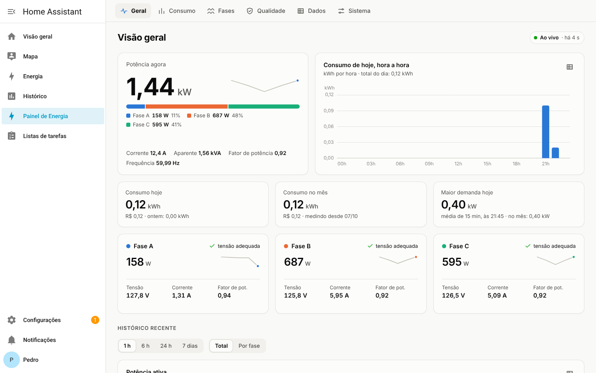
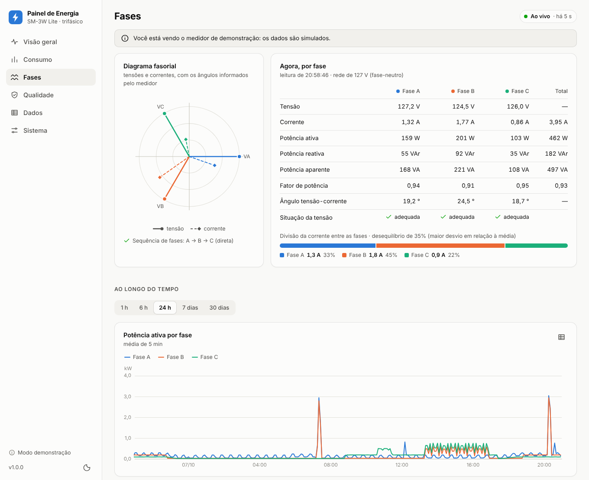
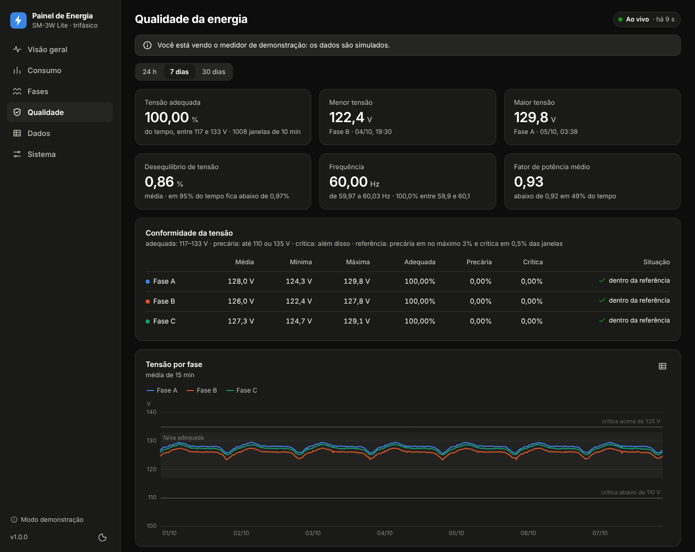
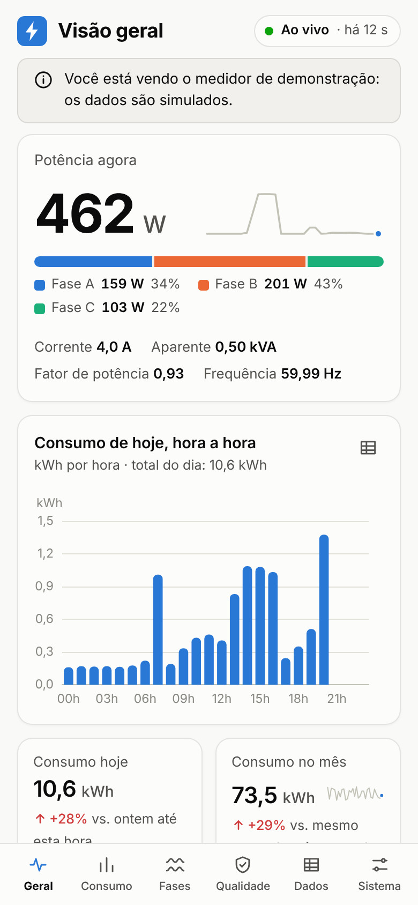

# Painel de Energia

Painel para o **Home Assistant** (add-on ou integração) que recebe as leituras do medidor **IE Tecnologia SM-3W Lite** (trifásico; o SM-W Lite monofásico também funciona), cria os sensores e mostra um painel completo na barra lateral. Tudo roda dentro do Home Assistant.



- **Fluxo de energia:** solar, rede e casa em tempo real, animado, com a geração do add-on Hoymiles DTU API.
- **Tempo real:** potência total e por fase, tensão, corrente, fator de potência, frequência.
- **Consumo e custo:** por hora, dia, mês e ano, com comparação com o período anterior, projeção do mês, demanda máxima e carga de base.
- **Fases:** diagrama fasorial, equilíbrio entre fases e histórico de cada grandeza.
- **Qualidade da energia:** tensão em relação às faixas do PRODIST, frequência e ocorrências (tensão fora da faixa, falta de fase, medidor sem enviar).
- **Dados:** qualquer uma das 40 grandezas em gráfico e tabela, exportação em CSV e cópia do banco.
- **Sensores nativos** prontos para o painel Energia do Home Assistant e para automações.
- Segue o tema claro/escuro do Home Assistant e funciona no aplicativo do celular.

| Fases | Qualidade (tema escuro) | Celular |
|---|---|---|
|  |  |  |

As imagens mostram dados simulados.

## Como funciona

```
medidor ──(HTTP POST na porta 8123)──▶ Home Assistant
                                         └─ integração Painel de Energia
                                              ├─ banco próprio (config/painel_energia/energia.db)
                                              ├─ sensores do Home Assistant
                                              └─ painel na barra lateral
```

O medidor envia um JSON com as leituras a cada 30 segundos. A integração grava tudo em um banco SQLite próprio (o histórico do Home Assistant não guarda o detalhe de que o painel precisa), calcula a energia pela diferença dos contadores do medidor e atualiza os sensores.

## Instalação como add-on (Home Assistant OS)

O add-on é a forma mais simples no Home Assistant OS: instala pela loja de add-ons, abre na barra lateral e não mexe em arquivos de configuração.

**Pelo GitHub (não precisa copiar arquivos para o HA):**

1. Crie um repositório público no GitHub e envie para ele o conteúdo desta pasta (no site: *Add file › Upload files*, arrastando tudo).
2. No Home Assistant: Configurações › Add-ons › Loja de add-ons › menu ⋮ › **Repositórios**, cole o endereço do repositório e adicione.
3. Recarregue a loja, abra **Painel de Energia** e toque em **Instalar** (a primeira instalação monta a imagem e leva alguns minutos).
4. Inicie o add-on, ligue **Mostrar na barra lateral** e abra o painel.

**Ou como add-on local:** copie a pasta `painel_energia_addon` para a pasta `addons` do Home Assistant (add-on Samba share ou Studio Code Server), depois Loja de add-ons › ⋮ › *Verificar atualizações*. Ele aparece em "Add-ons locais".

No add-on o medidor envia para a **porta 8080**, caminho `/api/ingest`. Para os sensores aparecerem no Home Assistant, tenha o add-on **Mosquitto broker** e a integração MQTT; o Painel de Energia encontra o broker sozinho. Para abrir o painel sem entrar no Home Assistant (por exemplo, num tablet), ligue a opção **Painel direto**: ele passa a abrir em `http://IP-DO-HOME-ASSISTANT:8081`. Detalhes em [`painel_energia_addon/DOCS.md`](painel_energia_addon/DOCS.md).

## Alternativa: integração (sem add-on e sem MQTT)

Vale para Home Assistant OS, Supervised e Container. Testada no Home Assistant 2026.2. Cria sensores nativos, sem broker.

1. Copie a pasta `custom_components/painel_energia` deste projeto para dentro da pasta de configuração do Home Assistant, de modo que fique `config/custom_components/painel_energia/`.
2. Reinicie o Home Assistant.
3. Abra **Configurações › Dispositivos e serviços › Adicionar integração** e procure **Painel de Energia**.
4. A tela seguinte mostra o que digitar no medidor (porta `8123`, caminho `/api/webhook/...`).

## Configurar o medidor

No navegador, abra o endereço do medidor (ex.: `http://192.168.0.100`), entre com o usuário e a senha do medidor e abra **Configurações**. Na seção **NUVEM**:

| Campo do medidor | Valor |
|---|---|
| Habilitar Transmissão | marcado |
| Tipo de envio | `Padrão` |
| Protocolo | `HTTP POST (Variáveis Payload Único)` |
| ID do Dispositivo | `1` (com mais de um medidor, um número diferente em cada) |
| IP ou Domínio do Servidor | `http://192.168.0.102` (o IP do seu Home Assistant) |
| Caminho | add-on: `/api/ingest` · integração: `/api/webhook/SEU-IDENTIFICADOR` |
| Porta | add-on: `8080` · integração: `8123` |
| Intervalo de transmissão | `30` segundos (o mínimo aceito) |

Toque em **Salvar**. A primeira leitura chega em até um minuto e o painel troca sozinho da tela de espera para a visão geral. Na tela de espera (e em Sistema) a lista **Mensagens recebidas** mostra cada envio do medidor e, se algum for rejeitado, o motivo.

Dicas: fixe no roteador o IP do medidor e o do Home Assistant. O caminho funciona como uma senha e, por padrão, só é aceito de aparelhos da rede local.

Se nada chegar: confira IP, porta e caminho; veja em Configurações › Sistema › Registros se aparece "Received message for unregistered webhook" (caminho digitado errado). Se o seu Home Assistant só atende por HTTPS, o medidor não consegue enviar na 8123: abra as opções da integração e ative a **porta dedicada** (por exemplo `8765`); nela qualquer caminho é aceito.

## Sensores e painel Energia

A integração cria um dispositivo por medidor, com:

- potência ativa total e por fase, tensão e corrente por fase, corrente total;
- fator de potência, frequência, potência reativa e aparente;
- **Energia consumida** e **Energia injetada** (kWh acumulados), consumo e injeção de hoje, consumo por fase;
- **Situação da tensão** de cada fase (adequada, precária, crítica, sem tensão);
- temperatura do medidor e sinal Wi-Fi (diagnóstico);
- desativados por padrão: fator de potência, reativa e aparente por fase, ângulos, energia injetada por fase.

No painel Energia do Home Assistant (Configurações › Painéis › Energia), use **Energia consumida** em "Consumo da rede" e **Energia injetada** em "Retorno à rede". Esses totais são mantidos pela integração e continuam crescendo mesmo quando o contador interno do medidor zera.

Quando o medidor para de enviar por mais de 3 minutos, os sensores ficam "indisponíveis", o que serve de gatilho para um aviso. Exemplos de cartões estão em [`homeassistant/cartoes_lovelace.yaml`](homeassistant/cartoes_lovelace.yaml) e um exemplo de automação em [`homeassistant/README.md`](homeassistant/README.md).

## Opções da integração

Em Configurações › Dispositivos e serviços › Painel de Energia › Configurar:

| Opção | Para que serve |
|---|---|
| Mostrar o painel na barra lateral | Esconde o painel e mantém só os sensores |
| Aceitar leituras só da rede local | Padrão ligado. Desligue apenas se o medidor estiver em outra rede |
| Porta dedicada para o medidor | HTTP simples em outra porta, aceitando qualquer caminho (para Home Assistant com HTTPS) |
| Tópico MQTT do medidor | Só se preferir que o medidor envie por MQTT; usa o broker da integração MQTT do Home Assistant |
| Unidade dos contadores | Deixe kWh; mude só se o painel avisar que os contadores parecem estar em Wh |
| Segundos sem leitura para considerar parado | Padrão 180 |
| Dias de leituras individuais guardadas | Padrão 400 (0 = para sempre); resumos de 15 minutos e energia nunca são apagados |
| Maior potência possível da instalação | Teto usado para descartar saltos absurdos do contador (padrão 80 kW) |

Tarifa, crédito por kWh injetado, modo de instalação e nomes das fases ficam no próprio painel, em **Sistema**.

## Dados e cópia de segurança

- O banco fica em `config/painel_energia/energia.db` e entra nos backups do Home Assistant junto com a pasta de configuração.
- Cópia avulsa: no painel, Sistema › Dados armazenados › *Baixar cópia do banco*. Exportação em CSV na aba Dados.
- Para atualizar a integração: substitua a pasta `custom_components/painel_energia` e reinicie o Home Assistant. O banco não é tocado.
- Para remover: exclua a integração e apague as pastas `custom_components/painel_energia` e `painel_energia` da configuração.

## Como a energia é calculada

O medidor envia contadores acumulados de kWh (total e por fase, consumo e geração). O painel soma a diferença entre leituras consecutivas, o que mantém os valores certos mesmo se o Home Assistant ficar um tempo fora do ar: ao voltar, a energia do intervalo é repartida pelo tempo e marcada como estimada. Reinícios do contador (ele zera na virada do mês), leituras corrompidas e recuos após queda de energia são detectados e não viram picos falsos. Com geração solar, o total de consumo/injeção vem do contador total do medidor, por isso pode diferir da soma das fases.

Para conferir com o seu medidor, **Sistema › Medidor › Conferência dos contadores** compara o avanço dos contadores com a energia que a potência medida indica nas últimas 24 horas. Os dois números devem ficar próximos.

O custo é uma estimativa: energia consumida × tarifa (menos o crédito por kWh injetado, se você configurar). Não inclui bandeiras, taxa mínima nem iluminação pública.

## Testar sem o medidor

O simulador envia leituras do mesmo jeito que o medidor:

```bash
python3 tools/simulador.py --url http://192.168.0.102:8123/api/webhook/SEU-IDENTIFICADOR
python3 tools/simulador.py --help        # solar, monofásico, intervalo...
```

Depois, exclua o medidor "SIMULADOR" em Sistema.

## Servidor próprio, sem Home Assistant

O mesmo painel também roda como um contêiner Docker separado, com broker MQTT opcional. Veja [`docs/servidor-proprio.md`](docs/servidor-proprio.md).

## Para desenvolver

O núcleo é Python puro (biblioteca padrão) e a interface é HTML/CSS/JavaScript sem etapa de build; os gráficos usam ECharts (incluído, licença Apache-2.0).

```
app/                              núcleo e servidor próprio (fonte)
  parser.py, energy.py, store.py, analytics.py, voltage.py, service.py ...
  static/                         interface web
painel_energia_addon/            add-on do Home Assistant (config.yaml, Dockerfile, run.py e cópia de app/)
custom_components/painel_energia/ integração do Home Assistant
  __init__.py, api.py, sensor.py, config_flow.py
  core/, frontend/                cópias de app/ e app/static/ (geradas por tools/sync_ha.py)
tools/                            simulador do medidor, sincronização e gerador de YAML
tests/                            testes automatizados
```

```bash
python3 tools/sync_ha.py                     # depois de mexer em app/, atualiza as cópias da integração
python3 -m unittest discover -s tests -t .   # testes
DATA_DIR=./data DEMO=1 python3 -m app        # painel com dados simulados em http://localhost:8080
```

## Limites conhecidos

- O formato das mensagens segue a documentação pública do SM-3W Lite e mensagens reais publicadas por usuários. A integração foi testada em um Home Assistant real com leituras simuladas, e o add-on foi testado como contêiner com um Supervisor simulado, mas não em um Home Assistant OS de verdade nem **com um medidor físico**: na primeira ligação, confira a lista de mensagens recebidas e a conferência dos contadores em Sistema.
- O histórico interno do medidor (arquivos `.txt`) não é importado; o painel começa a contar a partir da primeira leitura recebida.
- As leituras são instantâneas, a cada 30 s ou mais: eventos rápidos podem passar sem registro. Os indicadores de qualidade são estimativas e não substituem a medição da distribuidora.
